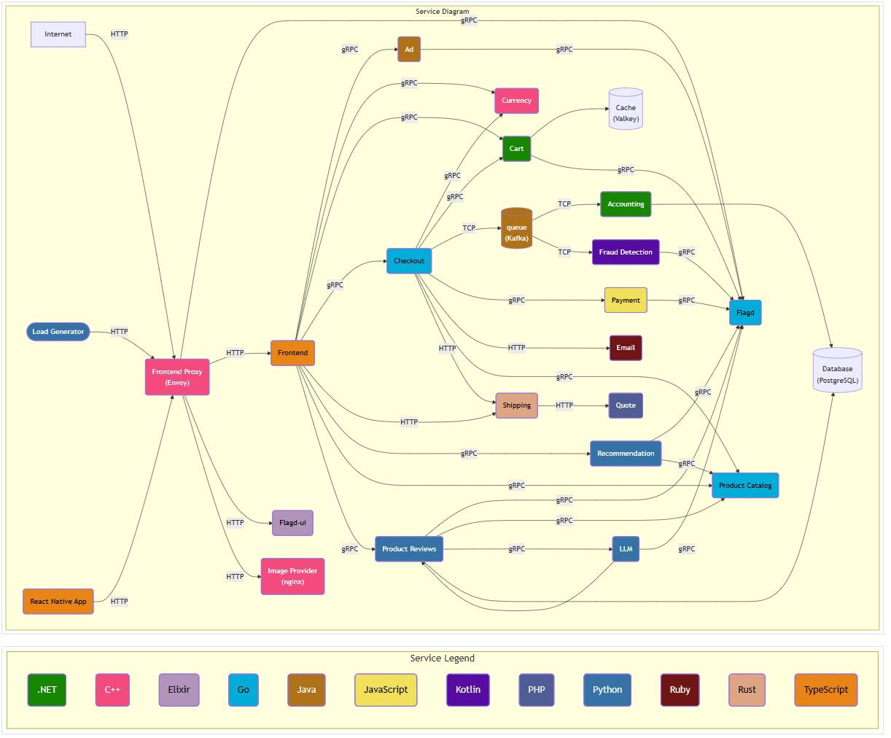
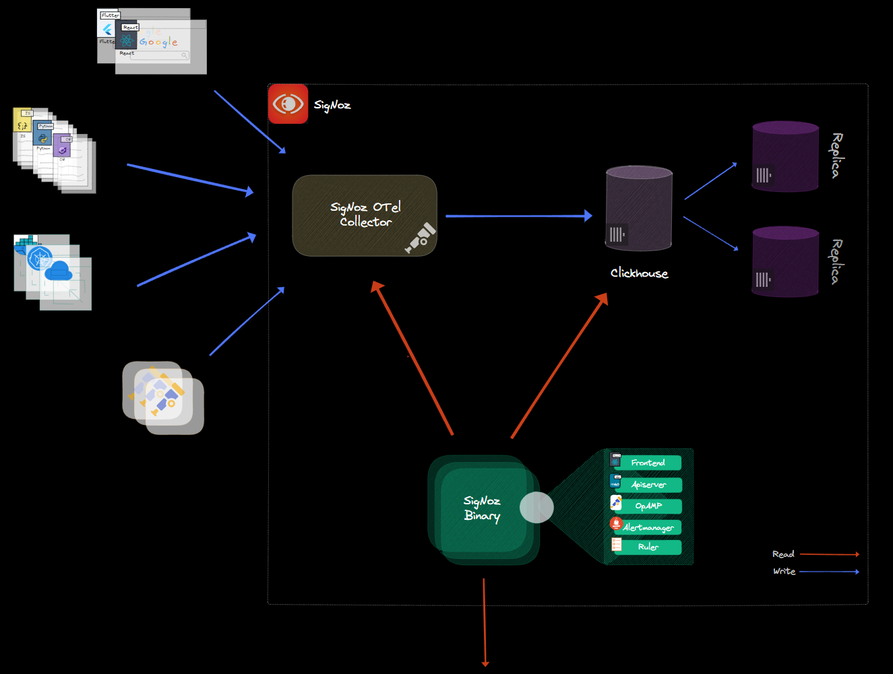
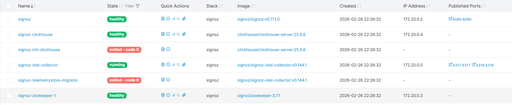
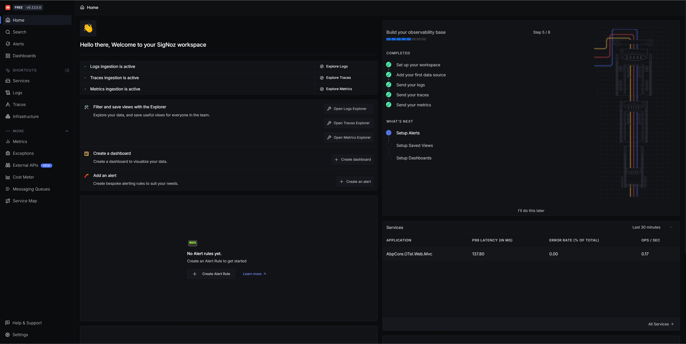
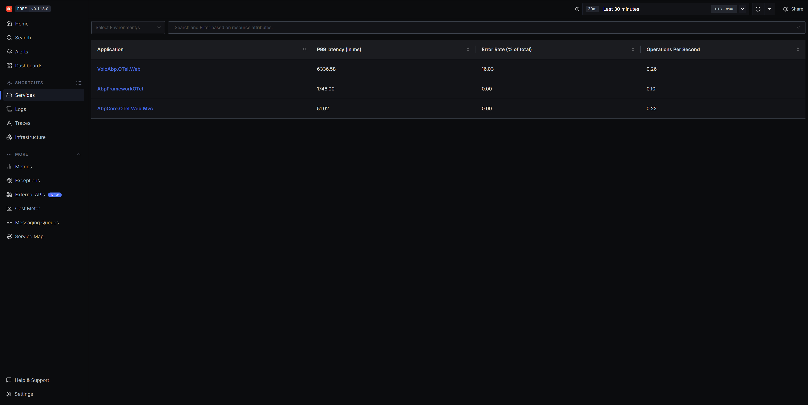
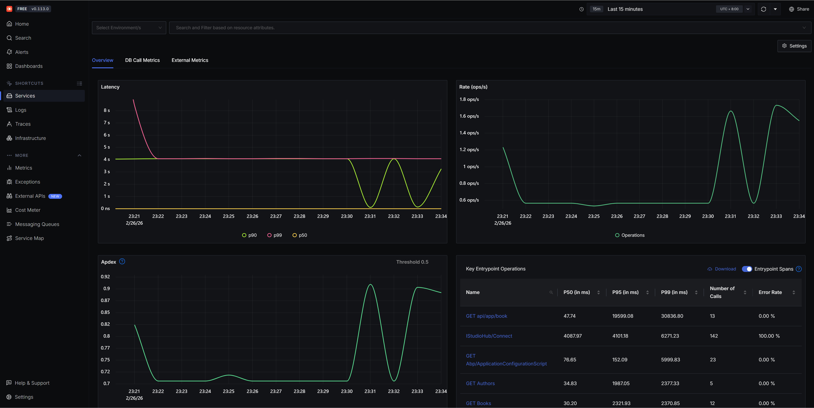
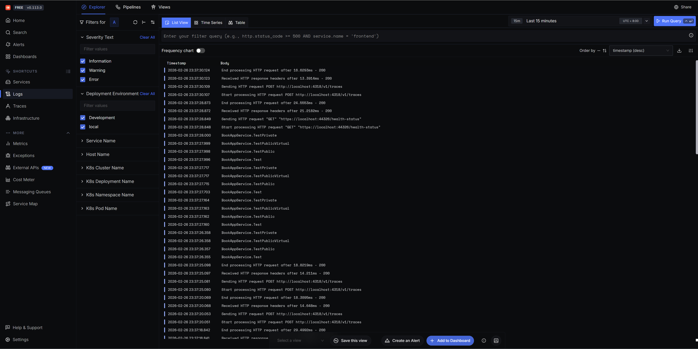
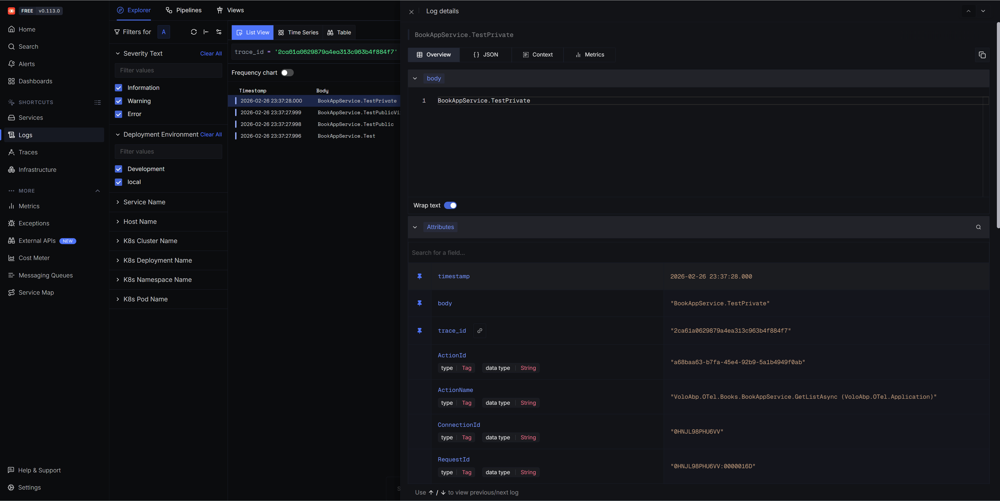
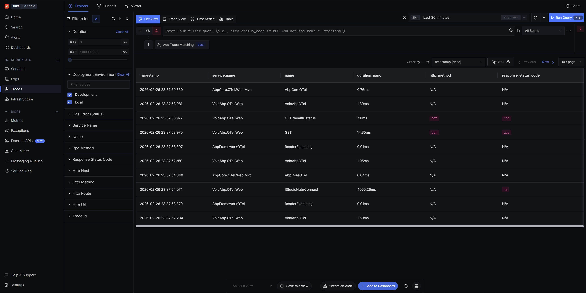
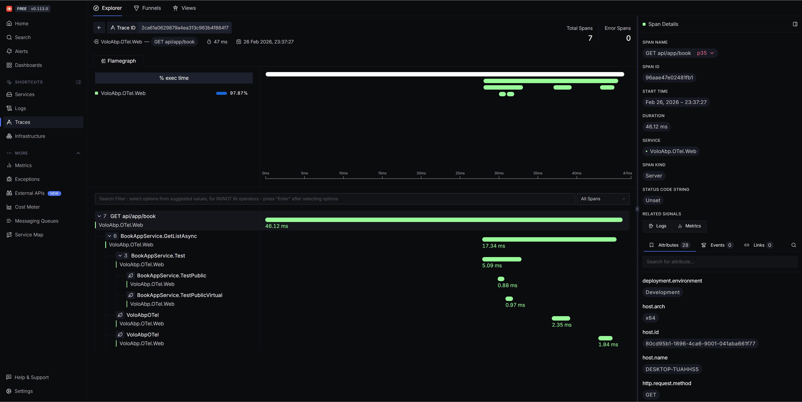

# 从“黑盒”到“全景”：在.NET中拥抱OpenTelemetry与SigNoz的可观测工具

[点击查看PDF文档](Unified_.NET_Observability.pdf)
> **项目简介**：本仓库是一个实战指南与示例集合，展示了如何在不同版本的 ABP 框架（从传统的 .NET Framework 4.6.2 到现代的 Volo.Abp）中集成 **OpenTelemetry (OTel)**，并将可观测性数据（Tracing, Logs, Metrics）统一输出到开源观测平台 **SigNoz**。


## 🚀 为什么需要可观测性？

作为开发者，你是否曾为这些问题困扰过？

* 问题排查像“开盲盒”：用户报告接口慢，你只能埋头翻看分散的日志文件，试图从碎片信息中拼凑出一次请求的完整路径。
* 监控数据“烟囱林立”：Metrics、Tracing、Logs 分散在不同的系统里，查看一个完整的问题上下文需要在多个标签页间反复横跳。
* 技术栈绑定之痛：一旦选用了某个APM厂商的SDK，迁移成本高到让人望而却步。

如果你对以上任何一点深感共鸣，那么是时候了解 OpenTelemetry（简称OTel）​ 和 SigNoz​ 这个组合了。它们一个定义了开放标准，一个提供了开箱即用的实现。


## [OpenTelemetry](https://opentelemetry.io/docs/what-is-opentelemetry)：可观测性
想象一下，你的应用是一个由微服务、数据库、消息队列组成的复杂城市。过去，每个组件（或APM厂商）都说着自己的“方言”（私有协议），导致沟通成本极高。
OpenTelemetry (OTel) 就是为解决这个问题而生的。​ 它由CNCF孵化，目标是为可观测性数据[（追踪、指标、日志）](https://opentelemetry.io/zh/docs/concepts/signals/)提供一套与供应商无关的、统一的采集和传输标准。你可以把它理解为可观测性领域的“普通话”或“USB-C接口”。  
它的核心优势在于：
* 供应商中立： 用一套SDK和API完成数据采集，通过简单的配置即可将数据发送到任何支持OTLP协议的后端（如kibana、Jaeger、zipkin、Tempo、SigNoz）。
* 一次集成，多处可用： 避免了对特定APM厂商的锁定，未来切换后端成本极低。  

[演示架构](https://opentelemetry.io/docs/demo/architecture/)


## [SigNoz](https://github.com/SigNoz/signoz/blob/main/README.md)：开箱即用的全景观测平台
Signoz 是一个基于 OpenTelemetry、ClickHouse、Go、TypeScript/React 等技术栈构建的开源可观测性平台，用于统一采集、分析和可视化日志、指标和链路追踪数据。  
[技术架构](https://signoz.io/docs/architecture/)

[SigNoz - 日志性能基准测试(与ElasticSearch、Loki比较)](https://signoz.io/blog/logs-performance-benchmark/?utm_source=github-readme&utm_medium=logs-benchmark)  
[ClickHouse vs. Elasticsearch：十亿行数据的较量](https://clickhouse.com/blog/clickhouse_vs_elasticsearch_the_billion_row_matchup)

## 🛠️ 环境搭建：安装signoz
使用 Docker Compose 快速安装：  
https://signoz.io/docs/install/docker/ 
```shell
git clone -b main https://github.com/SigNoz/signoz.git && cd signoz/deploy/
cd docker
docker compose up -d --remove-orphans
```

安装完成后，访问 http://127.0.0.1:8080 即可看到 SigNoz 的仪表盘。



## 📂 示例项目导航

本仓库包含针对不同 ABP 版本的集成方案，请根据你的项目背景选择：

| 项目名称 | 框架版本 | 说明 | 快速跳转 |
| :--- | :--- | :--- | :--- |
| **AbpFramework** | .NET Framework 4.6.2 | 适用于传统的 ABP (Legacy) 项目，集成 log4net 日志导出。 | [查看详情](https://github.com/ddrsql/OTelTest/tree/main/AbpFramework) |
| **AbpCore** | .NET Core 3.1+ | 适用于标准的 ABP 框架（基于 .NET Core 版本）。 | [查看详情](https://github.com/ddrsql/OTelTest/tree/main/AbpCore) |
| **VoloAbp** | .NET 6/8+ | 适用于最新的 Volo.Abp (vNext) 框架集成。 | [查看详情](https://github.com/ddrsql/OTelTest/tree/main/VoloAbp) |


## 🏁 使用效果
集成通过AOP（面向切面编程）拦截器实现了应用内方法的自动追踪，并在以下监控维度中清晰地展现了效果：
### Services（服务监控）


### Logs（日志）


### Traces（链路追踪）



### 被追踪的业务方法示例
以下是一个简单的服务类方法，其调用链将被追踪。方法内记录了日志，便于在Traces和Logs中关联观察。
```c#
public virtual void Test()
{
   Logger.LogInformation($"{nameof(BookAppService)}.{nameof(Test)}");
   TestPublic();
   TestPublicVirtual();
   TestPrivate();
}
public virtual void TestPublic()
{
   Logger.LogInformation($"{nameof(BookAppService)}.{nameof(TestPublic)}");
}
public virtual void TestPublicVirtual()
{
   Logger.LogInformation($"{nameof(BookAppService)}.{nameof(TestPublicVirtual)}");
}
private void TestPrivate()
{
   Logger.LogInformation($"{nameof(BookAppService)}.{nameof(TestPrivate)}");
}
```

### 通过AOP拦截器实现方法级追踪
VoloAbp中通过定义的[OTelActivityInterceptor](https://github.com/ddrsql/OTelTest/blob/main/VoloAbp/src/VoloAbp.OTel/OTel/OTelActivityInterceptor.cs)，它继承自Volo.Abp框架的AbpInterceptor。该拦截器负责在目标方法执行前后自动创建和停止OpenTelemetry的Activity，从而实现无侵入式的耗时追踪。[AbpFramework OTelActivityInterceptor ](https://github.com/ddrsql/OTelTest/blob/main/AbpFramework/AbpFramework.OTel/OTel/OTelActivityInterceptor.cs)与[AbpCore OTelActivityInterceptor](https://github.com/ddrsql/OTelTest/blob/main/AbpCore/src/AbpCore.OTel/OTel/OTelActivityInterceptor.cs)基本类似
```c#
public class OTelActivityInterceptor : AbpInterceptor, ITransientDependency
{
   private readonly ActivitySource _activitySource;
   //private readonly IJsonSerializer _jsonSerializer;
   private readonly ILogger<OTelActivityInterceptor> _logger;
   private readonly IConfiguration _configuration;
   private readonly OTelOptions _oTelOptions;

   public OTelActivityInterceptor(
      ActivitySource activitySource,
      //IJsonSerializer jsonSerializer, 
      ILogger<OTelActivityInterceptor> logger,
      IConfiguration configuration,
      IOptionsSnapshot<OTelOptions> oTelOptions
      )
   {
      _activitySource = activitySource;
      //_jsonSerializer = jsonSerializer;
      _logger = logger;
      _configuration = configuration;
      _oTelOptions = oTelOptions.Value;
   }

   public override async Task InterceptAsync(IAbpMethodInvocation invocation)
   {
      _logger.LogDebug($"方法调用前：{invocation.Method.DeclaringType?.Name}.{invocation.Method.Name}");
      if (!_oTelOptions.Enabled)
      {
            await invocation.ProceedAsync();
            return;
      }

      if (!OTelActivityHelper.IsOTelActivityMethod(invocation.Method, out var oTelActivityAttribute))
      {
            await invocation.ProceedAsync();
            return;
      }

      // https://opentelemetry.io/docs/languages/dotnet/traces/best-practices/
      Activity activity = null;
      try
      {
            activity = _activitySource.StartActivity(invocation.Method.DeclaringType?.Name + "." + invocation.Method.Name);
            //if (activity != null && activity.IsAllDataRequested == true)
            //{
            //    activity.SetTag("", "");
            //}
      }
      finally
      {
            await invocation.ProceedAsync();
            activity?.Stop();
            activity?.Dispose();
      }

      _logger.LogDebug($"方法调用后：{invocation.Method.DeclaringType?.Name}.{invocation.Method.Name}");
   }
}
```

## 📚 参考资料

* [OpenTelemetry 官方文档](https://opentelemetry.io/docs/)
* [SigNoz 官方文档](https://signoz.io/docs/)
* [OpenTelemetry Logs using log4net](https://lecarvalho.medium.com/opentelemetry-logs-using-log4net-f573a800c627)


### 🔍 延伸阅读/推广
📱 [运营商正规SIM卡：超大流量+通话短信全功能，推广可获返佣，点击查看 >>](https://github.com/ddrsql/OTelTest/blob/main/SIM.md)  
（推广：为中国移动/联通/电信/广电四大运营商正规发行的手机SIM卡，拥有11位手机号码，支持接打电话、收发短信等完整通信功能，可正常注册微信、绑定银行卡。资费详情及办理流程以活动页面为准。）