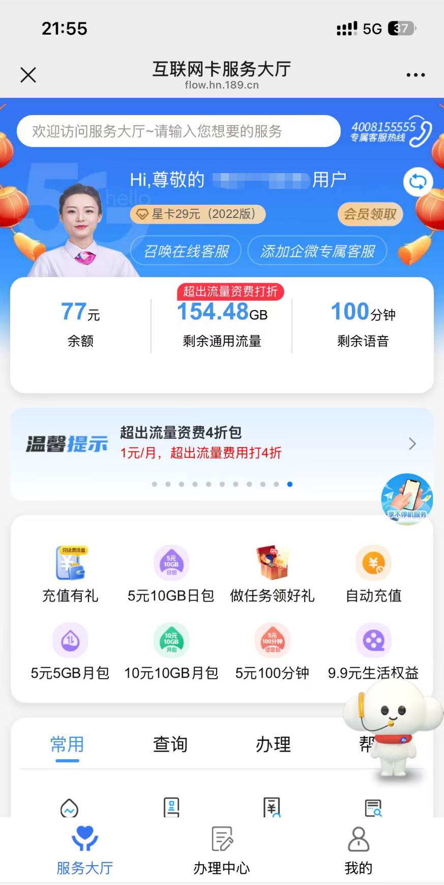
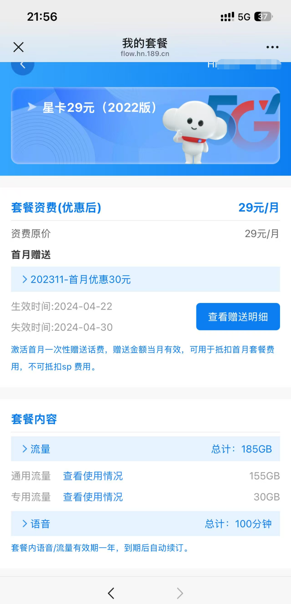
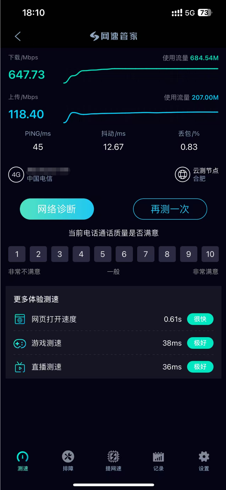

## 🚀 为你的数字生活提速：高性价比通信方案推荐

在追求技术效率的同时，一个稳定、高性价比的通信基础同样重要。我们为您甄选了一款兼顾**性价比、可靠性与功能完整性**的解决方案。

### 📱 产品核心亮点

**这不仅仅是一张“流量卡”，更是运营商正规发行的【手机SIM卡】**：
*   **⛑️ 正规可靠**：由 **中国移动、中国联通、中国电信、中国广电** 四大运营商之一直接发行，享有官方客服与售后保障。
*   **📞 功能完整**：配备 **11位真实手机号码**，**支持接打电话、收发短信**等所有基础通信功能。可无障碍注册微信、支付宝、银行APP及各类平台账号。
*   **🌐 高速流量**：套餐内含大额国内通用流量（或通用+定向组合），满足您日常学习、工作及娱乐所需。
*   **💳 资费透明**：月租低廉，套餐内容清晰，无隐形消费。

### 💰 分享即收益：推广返佣计划同步开放

我们同时开放了 **“分享返佣”合作计划**。如果您觉得本产品有价值，欢迎参与推广：
*   成功推荐朋友或读者办理并激活使用此卡，您即可获得相应的佣金奖励。
*   这是一种将您的专业知识与影响力变现的轻量级方式。
*   **具体佣金政策、结算周期及参与细则，请在推广平台页面内查看最新规则。**

> **🔍 行业小贴士 (2026年更新)**：当前通信市场正经历规范调整，市面上“高通用流量、低月租”的“神卡”套餐已大幅减少，且新套餐的通用流量普遍设限。因此，遇到合适的产品时建议深入了解、及时把握。务必通过正规渠道办理，仔细阅读套餐说明，重点关注**月租、流量构成（通用/定向）、合约期、优惠有效期**等关键信息。

### ❓ 常见问题快速答疑

**Q：这和只能上网的“物联卡”一样吗？**
**A：完全不一样！** 这是功能完整的**手机SIM卡**。物联卡（号段通常为14/106开头）主要用于智能设备联网，**不能通话发短信，且流量稳定性与售后均无法保障**。请务必选择正规手机卡，以保障您的通信安全与权益。

**Q：如何办理与参与推广？**
**A：** 点击下方按钮，即可 **一站式完成【产品详情浏览、在线申请办卡】以及【查看详细的推广返佣政策与参与入口】**。

---

### 号易
登录地址
```
https://yunhaoka.com/admin/index/login
```
注册地址
```
https://yunhaoka.com/admin/index/register?sharecode=68145209  
https://my.86hk.vip/#/pages/public/register?code=68145209
```
### 172号卡系统
登录地址
```
https://haoka.lot-ml.com/login.html
```
注册地址，推荐码：16180339
```
https://haoka.lot-ml.com/regper.html
```

---
### 🛠️ 实际使用介绍




*免责声明：本推广内容所述产品为运营商官方套餐，具体资费、流量规则、合约期及返佣政策可能随时间调整，请务必以申请页面及推广平台的最新说明为准。办理前请仔细阅读相关协议。*